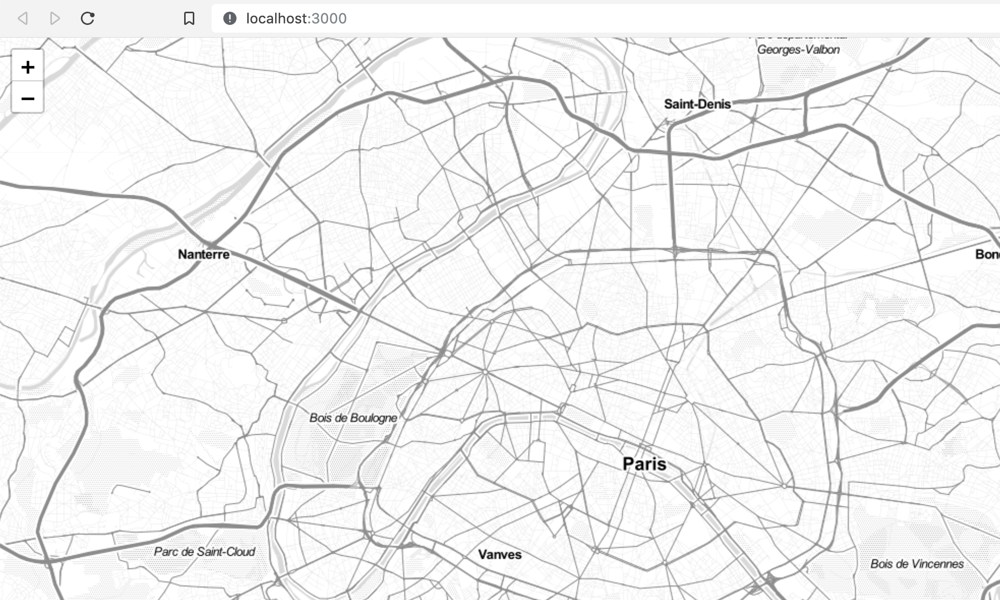

Afficher une carte en JS c'est plutôt facile, par exemple avec [React](https://reactjs.org) : OpenstreetMap ou Google fournissent des tiles gratuitement et [Leaflet](https://leafletjs.com) ou d'autres rendent une carte sans beaucoup de paramétrage.
Par contre, commencer à ajouter des éléments un peu avancés directement sur cette carte, par exemple du SVG, peut devenir compliqué ... [D3](https://d3js.org/) gère super bien les éléments vectoriels, alors pourquoi ne pas l'utiliser ?

Mais surtout, comment faire pour gérer proprement les éléments SVG en React ? C'est à dire de manière dynamique et instinctive. En effet, on se heurte souvent à quelques difficultés lorsque l'on mélange React et les librairies complexes qui agissent directement sur le DOM comme Leaflet ou D3. Je vais essayer de vous montrer quelques astuces ici à travers un exemple : afficher dynamiquement des stations de métro sur la carte de Paris !

Aller, c'est parti !

## Une version headless de Leaflet ?

Déjà, je ne vais pas utiliser les composants React-Leaflet ou autres, mais plutôt Leaflet directement. Bon, comme c'est fait pour être utilisé dans un browser car Leaflet agit sur le DOM, il faut déjà se prémunir des problèmes de rendu en backend de React. En effet, il n'y a pas de version headless de Leaflet actuellement (`headless-leaflet` n'étant pas maintenu malheureusement).

Si la librairie n'est appelée que lorsque l'on est sûr que le composant est instancié, et donc que le DOM existe, tout se passe bien. Pour ça on peut faire l'import dans `ComponentDidMount` qui n'est appelé que tout à la fin du processus de React (voir [ce super graphique](http://projects.wojtekmaj.pl/react-lifecycle-methods-diagram/)) !

Ainsi, on va utiliser le package `leaflet`, depuis lequel j'importe le css sans problème, puis le JS dans ComponentDidMount :

```javascript
import React, { Component } from "react"
import "leaflet/dist/leaflet.css"

var L = null

class Map extends Component {
  componentDidMount() {
    // Ici, on est sûr que le composant est bien monté, plus de problème de "window" indéfini etc.
    L = require("leaflet")
  }

  render() {
    return <div />
  }
}
```

Donc, on a tout pour que Leaflet fonctionne bien. Je vais créer une carte toute simple, qui prend tout l'écran. Tout d'abord le conteneur de la carte :

```javascript
render() {
    return (
        <div
            style={{
                position: 'absolute',
                top: 0,
                bottom: 0,
                left: 0,
                right: 0
            }}
            id="map"
        />
    )
}
```

Et l'instanciation avec Leaflet, comme on l'a dit pas avant `ComponentDidMount`. Moi, j'aime bien utiliser OpenStreetMap, et par exemple je vais prendre une version plutôt légère de la carte :

```javascript
componentDidMount() {
    L = require('leaflet')

    const parisCenter = [48.8591, 2.349]
    const initialZoom = 12

    const map = L.map('map').setView(parisCenter, initialZoom)
    L.tileLayer('http://{s}.tile.stamen.com/toner-lite/{z}/{x}/{y}.png', {
        maxZoom: 18
    }).addTo(map)
}
```

Et voilà ! Notre jolie carte, qui fonctionne super bien en React, sans utiliser un truc comme `React-Leaflet`. Du coup, on va avoir accès à l'ensemble de l'[API Leaflet](https://leafletjs.com/reference-1.5.0.html) sans soucis !



Une dernière petite chose, on va souvent appeler notre objet `map`, qui est créé par Leaflet, dans notre composant. Pourquoi ne pas le sauvegarder dans notre state ?

```javascript
componentDidMount() {
    // ...

    this.setState({ map })
}
```

## La couche vectorielle

Leaflet génère une carte et ça marche très bien. Par défaut, une couche de carte est créée et on a utilisé `addTo(map)` pour la positionner dans notre conteneur. Il nous faudrait une autre couche pour nos éléments vectoriels.

Malheureusement, ce n'est pas ultra facile de trouver la bonne marche à suivre sur Internet, par qu'il semble que ça change au fil des versions de Leaflet. Et puis on peut dire que la doc. de l'API est plutôt légère ... Pourtant, c'est super simple :

```javascript
componentDidMount() {
    // ...

    L.svg().addTo(map)

    this.setState({ map })
}
```

Et c'est tout. Une couche SVG est créée, par défaut elle fait toute la carte ! Par la suite, l'élément est accessible en le sélectionnant avec D3 par exemple avec `d3.select('#map').select('svg')`.


## Les éléments vectoriels

### Le cas facile

Maitenant que l'on a une couche, il suffit de faire comme d'habitude avec D3 pour ajouter des éléments. Bien sûr on importe d3 en premier : `import * as d3 from 'd3'`. Par contre, se pose la question de où et comment les ajouter puisque l'on travaille avec React. Hmm ...

D'abord, il faut que la carte existe et que la couche soit créée, et ça on l'a fait dans `ComponentDidMount`. Autant ajouter les éléments juste après non ? Ouai ...

D3 marche super bien pour le traitement de "data", pour faire des graphs par exemple. Du coup, si on crée les éléments vectoriels dans `ComponentDidMount`, encore faut-il avoir la data à ce moment. En plus, il ne faut pas qu'elle soit modifiée, sinon il faut réinstancier le composant `Map` pour recharger les éléments (en changeant sa `key` par exemple). Tout ça parce que `ComponentDidMount` n'est appelée qu'une seule fois, au début de la vie du composant ...

Mais bon, dans certains cas c'est suffisant. On pourrait afficher toutes les stations de métro à Paris en même temps, et ce sont toujours les mêmes.

```javascript
const stations = [
    { name: 'Pernety' },
    { name: 'Brochant' },
    { name: 'Concorde' },
    { name: 'Saint-Paul' },
    { name: 'Invalides' }
]

componentDidMount() {
    // ...

    const svg = d3.select('#map').select('svg')
    const g = svg.append('g').attr('id', 'stations-group')

    const stationsElements = g.selectAll('circle.station').data(stations).enter().append('circle')

    this.setState({ map, stationsElements })
}
```

```css
circle {
  fill: red;
  r: 5px;
}
```

Encore une fois, je préfère sauvegarder les éléments dans le state pour plus tard.


Ah, mais attendez. On a un problème important là. Comment faire pour que mes stations se positionnent correctement sur la carte ? Et puis, encore mieux, qu'elles suivent lorsque je me déplace sur la carte, que je zoom etc.

En réalité, on traitera ce sujet plus tard, parce que ce n'est pas encore très important ici. Nous avons juste créé nos éléments SVG "circle", on les déplacera ensuite.

### Le cas moins facile

Imaginons maintenant que j'affiche la liste des stations de métro à Paris, qui sont le résultat d'une recherche.

Je pourrais stocker toutes les stations dans mon composant et trier pour l'affichage, mais prennons plutôt le cas où la liste des stations à afficher est filée en props à la carte. Après tout, en React, c'est toujours mieux de séparer les composants "intelligents" (les "containers") des composants qui ne font que de l'affichage (les "presentationals").

Maintenant, on veut qu'à chaque fois qu'une nouvelle liste de points à afficher est donnée, ils soient modifiés sur la carte. Avec les dernières versions de React, on utilise maintenant `componentDidUpdate` qui est très utile pour checker s'il faut faire quelque chose en fonction des nouvelles props.

Une nouvelle prop, c'est un update donc la fonction `componentDidUpdate` sera appelée. Mais ... ça peut arriver avec n'importe quelle prop ! Un check s'impose donc pour éviter de recharger quand il n'y a rien à faire.

```javascript
// Dans le composant principal
const stations = [
    { name: 'Pernety' },
    { name: 'Brochant' },
    { name: 'Concorde' },
    { name: 'Saint-Paul' },
    { name: 'Invalides' }
]


// ...
// Création du composant Map
render() {
    return <Map stations={stations} />
}
```

```javascript
// Dans le composant Map
componentDidUpdate(prevProps, prevState) {
    const { stations } = this.props

        // S'il n'y a pas encore d'éléments,
        // ou si les stations ont changées
        if (prevProps.stations !== stations || !this.state.stationsElements) {
            const svg = d3.select('#map').select('svg')
            d3.select('#stations-group').remove()
            const g = svg.append('g').attr('id', 'stations-group')
            const stationsElements = g
                .selectAll('circle')
                .data(stations)
                .enter()
                .append('circle')
                .attr('id', s => s.id)

            this.setState({ stationsElements })
        }
    }
}
```

Les éléments SVG ne doivent changer que si les stations données en props sont modifiées, et pas autrement.

## Et la position des points sur la carte dans tout ça ?

Et oui, il nous reste ce morceau, qui a première vue n'est pas le plus simple. En fait, Leaflet fourni une série de fonctions qui vont nous aider.

Pour commencer, regardons un peu comment fonctionnent les données utilisables par Leaflet. A priori, une station est repérée par ses coordonnées : latitude et longitude. D'après la documentation, le plus simple est d'utiliser un object `LatLng` qui wrap tout ça.

Déjà, ajoutons les coordonnées GPS de nos stations avec `LatLng`. Puisque nous savons depuis le début que `L` n'est utilisable qu'avec le browser, je vais stocker les coordonnées en brut et les convertir en `LatLng` uniquement lors de leur utilisation :

```javascript
const stations = [
  { id: 1, name: "Pernety", latitude: 48.83393639, longitude: 2.318078285 },
  { id: 2, name: "Brochant", latitude: 48.89058719, longitude: 2.320174756 },
  {
    id: 3,
    name: "Concorde",
    latitude: 48.866359597499994,
    longitude: 2.3228444057499997,
  },
  {
    id: 4,
    name: "Saint-Paul",
    latitude: 48.85523625,
    longitude: 2.360956489,
  },
  { id: 5, name: "Invalides", latitude: 48.862345015, longitude: 2.314524005 },
]
```

Et on utilise donc un object `LatLng` lors de la liaison des données avec D3, que ça soit dans `ComponentDidMount` pour le cas simple ou `ComponentDidUpdate` pour le cas un peu plus complexe :

```javascript
const stationsElements = g
  .selectAll("circle")
  .data(
    stations.map(d => ({
      ...d,
      latLng: new L.LatLng(d.latitude, d.longitude),
    }))
  )
  .enter()
  .append("circle")
  .attr("id", s => s.id)
```

Et enfin la partie la plus intéressante : la fonction de Leaflet `latLngToLayerPoint(<LatLng> latlng)`. Elle permet de convertir un objet `LatLng`, donc des coordonnées GPS absolues, en des coordonnées x et y relatives au conteneur de la carte Leaflet. On va pouvoir ainsi positionner notre station sur la carte correctement.

Pour plus de clareté, je propose de travailler la position des stations dans une fonction séparée, que j'appelle `mapElementsToMap`. Ainsi, il suffira d'appeler cette fonction dès que l'on considère que ça doit être fait, par exemple si on zoom.

```javascript
mapElementsToMap() {
    const { stationsElements, map } = this.state

    if (map && stationsElements) {
        stationsElements.attr(
            'transform',
            d =>
                'translate(' +
                map.latLngToLayerPoint(d.latLng).x +
                ',' +
                map.latLngToLayerPoint(d.latLng).y +
                ')'
        )
    }
}
```

Et puis, puisque l'on fait appel à `state` dans cette fonction, il faut bien sûr penser à la bind à l'élément :

```javascript
constructor(props) {
    super(props)
    this.mapElementsToMap = this.mapElementsToMap.bind(this)
}
```

Reste plus qu'à faire des mises à jour régulièrement. Donc, on l'a dit quand le zoom est modifié : event `zoom` d'après la documentation de Leaflet. N'oublions pas aussi le cas où on instancie les éléments SVG pour la première fois. Rajoutons alors des évènements quand la carte est créée dans `ComponentDidMount` :

```javascript
map.on("zoom move", () => {
  this.mapElementsToMap()
})
```

Et quand on créé les éléments SVG, soit dans `ComponentDidMount` soit `ComponentDidUpdate`. Par contre problème ici ... On devrait appeler la fonction `mapElementsToMap` qui utilise `stationsElements` du state. Cependant, au début, le state n'est peut-être pas encore mis à jour.

En fait, quand on met à jour et que l'on utilise le state en même temps dans une fonction, il faut toujours faire attention : `setState` n'est peut-être pas appelé tout de suite et peut être délayé par React. Pour éviter le cas où `mapElementsToMap` n'aurait pas accès à `stationsElements`, on va la modifier un peu et forcer l'accès à ces éléments s'ils sont nouvellement créés :

```javascript
mapElementsToMap(stationsElementsForced = null) {
    const { stationsElements: stationsElementsFromState, map } = this.state
    const stationsElements = stationsElementsForced || stationsElementsFromState

    if (map && stationsElements) {
        stationsElements.attr(
            'transform',
            d =>
                'translate(' +
                map.latLngToLayerPoint(d.latLng).x +
                ',' +
                map.latLngToLayerPoint(d.latLng).y +
                ')'
        )
    }
}
```

Et on peut maintenant appeler cette fonction en forcant les éléments juste après la création en faisant :

```javascript
this.mapElementsToMap(stationsElements)
```

Tada ! Les stations s'affichent, et se déplacent correctement avec la carte, tout comme on voulait !

## Quand les props changent

Bon, l'objectif c'était quand même de réussir à mettre à jour en direct les stations affichées sur la carte quand les stations données en props changent. Tout fonctionne maintenant pour ça, on va simplement faire une petite démo avec un champ de recherche. Avec ce que l'on a mis en place, il n'y a rien à faire de plus que de modifier les props envoyés à `Map` ! Tout est géré en interne dans le composant.

Je ne vais pas développer trop ici, l'exemple est disponible sur Github et ce n'est pas le sujet de cet article :). Mais voilà un résultat dynamique et plutôt sympa à mettre en oeuvre :


